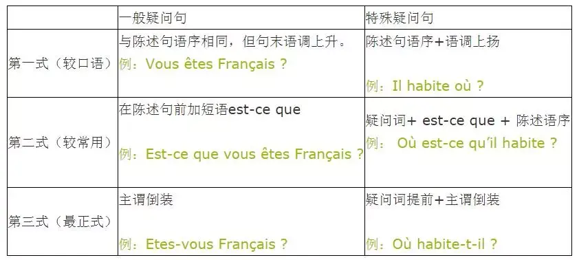

## 一般疑问句和特殊疑问句

要真正搞懂法语里的疑问句，首先就要分清一般疑问句和特殊疑问句。

### 一般疑问句：对整句话进行提问，句中没有疑问词；可以用是/否来回答。

例：

问：Vous êtes Français ?

答：Oui, je suis Français. / Non, je ne suis pas Français.

### 特殊疑问句：对句子中的某一个部分进行提问，有疑问词；不能用单纯的是/否来回答。

例：

问：Où habites-tu ?

答： J'habite à Paris.

## 一般疑问句的三种基本形式

为了突出重点下面每种形式均使用相同的例句

1. 与陈述句语序相同，句末语调上升并加问号

解读：最简单的一般疑问句形式。口语中使用最多。

例：

   - Vous êtes Français. → Vous êtes Français ?

- Tu es libre ce soir. → Tu es libre ce soir ?

2. 在陈述句前加短语 est-ce que

解读：“万能”句式，使用方便，也相对正式。

 - Vous êtes Français. → Est-ce que vous êtes Français ?

  - Tu es libre ce soir. → Est-ce que tu es libre ce soir ?

3. 主谓倒装

解读：最正式的疑问句问法，但有许多需要注意的地方。

 - Vous êtes Français. → Est-ce que vous êtes Français ?

 - Tu es libre ce soir. → Est-ce que tu es libre ce soir ?

需要注意的细节：

※ 如果倒装的主语是代词，需要使用连字符。（例：Es-tu libre ce soir ?）

※ 在第三人称单数倒装疑问句中，如果动词是以元音字母结尾的，为了方便读音，则会在动词和代词之间加上字母t，并且加连字符。（例：A-t-il faim ? ）

## 特殊疑问句的三种基本形式

1. 陈述句语序，疑问词放在句中成分相应位置

解读：使用起来最方便，适用于口语表达。

Il habite où ?

2. 疑问词+ est-ce que + 陈述语序

解读 ：比较正式的表达

Où est-ce qu'il habite ?

3. 疑问词+主谓倒装

解读：最正式的疑问句表达方式，细节同样需要注意。

例 ：

Où habite-t-il ?

## 一般疑问句和特殊疑问句三式的对比

不过归根结底，这些形式是帮助我们理解，在真正的使用当中是会存在很多习惯性用法的，尤其是在口语当中。比如Qui est votre professeur ? ，一般就不会说Votre professeur est qui ? 更不会说Qui est-ce que votre professeur est ? 虽然从语法的角度上来说它们都不能算错。